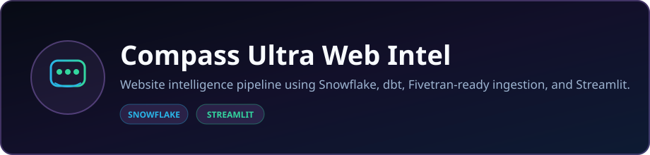

<p align="center">
  
</p>

<p align="center">
  <strong>Website intelligence pipeline using Snowflake, dbt, Fivetran-ready ingestion, and Streamlit.</strong>
</p>

<p align="center">
  <a href="https://compass-ultra-web-intel.streamlit.app/"></a>
  <a href="https://github.com/DaCameraGirl/Compass-Ultra-Web-Intel"></a>
  <a href="https://www.compassultra.com"></a>
</p>

<p align="center">
  
  
</p>

### Languages

<p align="center">
  
  
  
</p>

### Stack

<p align="center">
  
  
  
</p>

<p align="center">
  Built by <strong>Angela Hudson</strong> · <a href="https://github.com/DaCameraGirl">DaCameraGirl</a>
</p>
---

<p align="center"></p>
<p align="center"></p>


Compass Ultra Web Intel turns a company name or website into a live research run:

1. 🔎 resolve the company or source website
2. 🌐 discover related public pages with Tavily
3. 🕷️ crawl useful website content
4. ❄️ load raw pages into Snowflake
5. 🧱 rebuild dbt marts and tests
6. 📊 show prospect, competitor, and market signals in Streamlit
7. 🤖 optionally generate sourced AI summaries with Anthropic, OpenAI, OpenRouter, or DeepSeek

The product is built for the same Compass Ultra world as the main app: feature flags, release gates, stale flag debt, approval workflows, rollback evidence, CAB handoffs, and safe production change.

---

<p align="center"></p>
<p align="center"></p>


Open the local app:

```powershell
.\Start-CompassUltraWebIntel.ps1
```

Or run Streamlit directly:

```powershell
streamlit run app\streamlit_app.py
```

In the app:

1. Type a company name or website into **Analyze company or website**.
2. Pick how many pages to crawl per discovered site.
3. Click the full-width **Run Analysis** button.
4. Watch the live discovery, crawl, Snowflake load, and dbt build logs.
5. Review the refreshed domain table and ranked website signals.

The app uses one main input. That input drives both the live run and the focused results below it.

Compass Ultra Web Intel is a public data-engineering portfolio project that turns company web presence into structured market-intelligence signals using Python crawling, Snowflake loading, dbt modeling, and a Streamlit analytics layer. Public demo mode uses seeded data, while approved users can unlock live workflows through guarded access controls.

---

<p align="center"></p>
<p align="center"></p>


The active signal engine scores websites for Compass Ultra fit using signals like:

- 🚩 feature flag mentions
- 🚀 release, deploy, rollback, canary, and CAB language
- 🛡️ audit, compliance, SOC 2, change management, and review terms
- 🔁 workflow terms like Slack, Jira, GitHub, CI/CD, and runbooks
- 🧹 stale flag, flag debt, ownership, approval, and cleanup language

Output tables:

- `ANALYTICS.MART_WEBSITE_QUERY_INDEX`
- `ANALYTICS.MART_PROSPECT_ACCOUNTS`
- `ANALYTICS.FCT_WEBSITE_SIGNALS`

---

<p align="center"></p>
<p align="center"></p>


| Layer | Tool | Job |
| --- | --- | --- |
| 🖥️ App | Streamlit | Live company runner and query UI |
| 🐍 Ingestion | Python | Discovery, crawling, parsing, Snowflake loading |
| ❄️ Warehouse | Snowflake | Raw public pages and analytics outputs |
| 🧱 Modeling | dbt Core + dbt Snowflake | Staging, marts, tests |
| 🔎 Discovery | Tavily | Company lookup and related-site search |
| 🤖 Optional AI | Anthropic, OpenAI, OpenRouter, DeepSeek | Sourced summaries over retrieved pages |
| 🔌 Optional ops | Fivetran, Stripe, Vercel, Compass backend | Future operational intelligence sources |

```text
Company / website
  -> Tavily discovery
  -> Python crawler
  -> Snowflake RAW_WEBSITE_INTEL.PAGES
  -> dbt staging + marts
  -> Streamlit Web Intel app
```

### 🧬 Language Bar

GitHub's language bar is tuned with `.gitattributes` so it emphasizes the real product code:

- 🐍 Python for the crawler, loaders, Streamlit app, and validation scripts
- 🧱 SQL for dbt staging and mart models
- 💻 PowerShell for Windows launchers
- ⚙️ YAML/TOML for dbt, Streamlit, and config
- 📦 TypeScript/HTML only for lightweight store-wrapper scaffolding

---

<p align="center"></p>
<p align="center"></p>


```powershell
py -3.11 -m venv .venv
.\.venv\Scripts\Activate.ps1
pip install -r requirements.txt
Copy-Item .env.example .env
```

Fill `.env` with your real values. Never commit `.env`.

Validate configuration:

```powershell
python scripts\validate_environment.py
```

Create the raw website table:

```powershell
python scripts\crawl_websites_to_snowflake.py --bootstrap-only
```

Run the app:

```powershell
streamlit run app\streamlit_app.py
```

---

<p align="center"></p>
<p align="center"></p>


Required for the live workflow:

```text
TAVILY_API_KEY
SNOWFLAKE_ACCOUNT
SNOWFLAKE_USER
SNOWFLAKE_PASSWORD
SNOWFLAKE_ROLE
SNOWFLAKE_WAREHOUSE
SNOWFLAKE_DATABASE
SNOWFLAKE_SCHEMA
```

Optional AI answer providers:

```text
ANTHROPIC_API_KEY
OPENROUTER_API_KEY
OPENAI_API_KEY
DEEPSEEK_API_KEY
```

Public deployment guardrails:

```text
COMPASS_PUBLIC_MODE=true
COMPASS_ACCESS_CODE=choose-a-private-access-code
COMPASS_LIVE_RUNS_ENABLED=true
COMPASS_MAX_PAGES_PER_RUN=5
COMPASS_RUN_COOLDOWN_SECONDS=900
```

Local trusted runs can use:

```text
COMPASS_ACCESS_MODE=local
```

Optional later sources:

```text
FIVETRAN_API_KEY
FIVETRAN_API_SECRET
DATABASE_URL
STRIPE_SECRET_KEY
VERCEL_TOKEN
```

See [GET_KEYS.md](GET_KEYS.md) for account/key guidance.

---

<p align="center"></p>
<p align="center"></p>


Run the default Compass Ultra seeded discovery:

```powershell
.\Run-WebsiteDiscovery.ps1
```

Run another source website:

```powershell
.\Run-WebsiteDiscovery.ps1 -SourceUrl https://www.example.com/ -MaxPages 5
```

That command discovers related websites, crawls them, loads Snowflake, rebuilds dbt, and opens the local app.

---

<p align="center"></p>
<p align="center"></p>


Discover related websites:

```powershell
python scripts\discover_websites.py --source-url https://www.example.com/
```

Crawl discovered websites into Snowflake:

```powershell
python scripts\crawl_websites_to_snowflake.py --urls-file targets\discovered_websites.txt --max-pages 25
```

Load a crawler-safe JSON feed:

```powershell
python scripts\crawl_websites_to_snowflake.py --feed-file C:\path\to\crawler-feed.json --skip-urls-file
```

Build dbt marts:

```powershell
$env:DBT_PROFILES_DIR = (Get-Location).Path
dbt build --select stg_web_pages fct_website_signals mart_prospect_accounts mart_website_query_index
```

---

<p align="center"></p>
<p align="center"></p>


GitHub Pages is not enough for this app because it only serves static files. Compass Ultra Web Intel needs a Python/Streamlit runtime plus secrets for Snowflake and Tavily.

Best free path:

1. Push this repo to GitHub.
2. Deploy it on **Streamlit Community Cloud**.
3. Choose repo `DaCameraGirl/compass-ultra-web-intel`, branch `main`, and main file path `app/streamlit_app.py`.
4. Add secrets in Streamlit's secrets manager, not in GitHub.
5. Share the Streamlit app URL.

For a polished public version, use Streamlit secrets for the keys above plus the public guardrail settings. Unauthenticated visitors see the seeded intelligence workspace and full product flow; approved users can unlock the live Snowflake, Tavily, crawler, dbt, and AI workflow with the access code.

---

<p align="center"></p>
<p align="center"></p>


These are wired for later, but not required for the active website-intelligence workflow:

- `scripts\compass_to_snowflake.py` - Compass backend, Stripe, and Vercel data
- `scripts\fivetran_to_snowflake.py` - Fivetran connector and destination metadata

If another local Compass backend `.env` already has useful values, point this repo to it:

```text
COMPASS_BACKEND_ENV_FILE=C:\Users\enter\Compass-Ultra-Backend\.env
```

The scripts read values locally and never print secret values.

---

<p align="center"></p>
<p align="center"></p>


Store-wrapper scaffolding lives in `store/`.

- 📱 Android and iOS: `store/capacitor`
- 🌐 PWA manifest: `store/pwa/manifest.webmanifest`
- 🪟 Microsoft Store notes: `store/microsoft`

Before a real store submission, host the app at a production HTTPS URL and set `COMPASS_WEB_INTEL_URL` for the Capacitor wrapper. Store submissions also require developer accounts, signing certificates, screenshots, privacy labels, and production icons.

---

<p align="center"></p>
<p align="center"></p>


- [GET_KEYS.md](GET_KEYS.md) - accounts and API key setup
- [docs/TECH_STACK.md](docs/TECH_STACK.md) - stack notes and GitHub language detection

---

<div align="center">

### 🧭 Compass Ultra judges whether the release is safe.

**Most flag platforms manage flags. Compass Ultra decides if the ship is ready.**

</div>